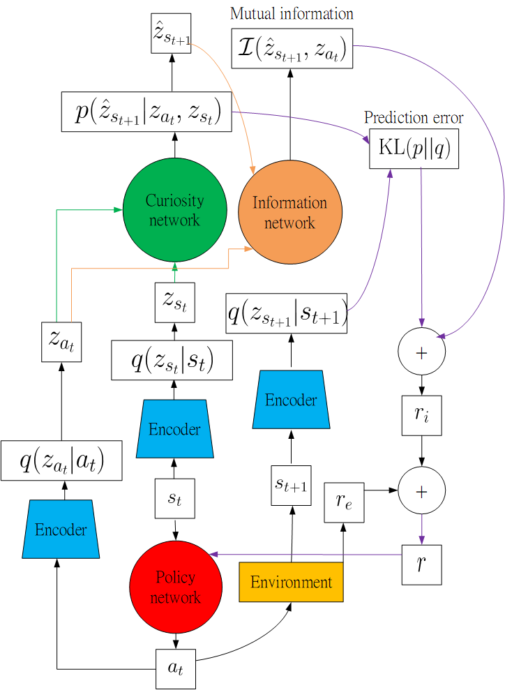
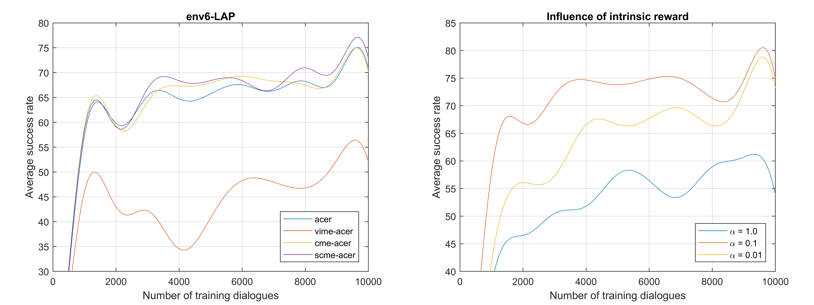
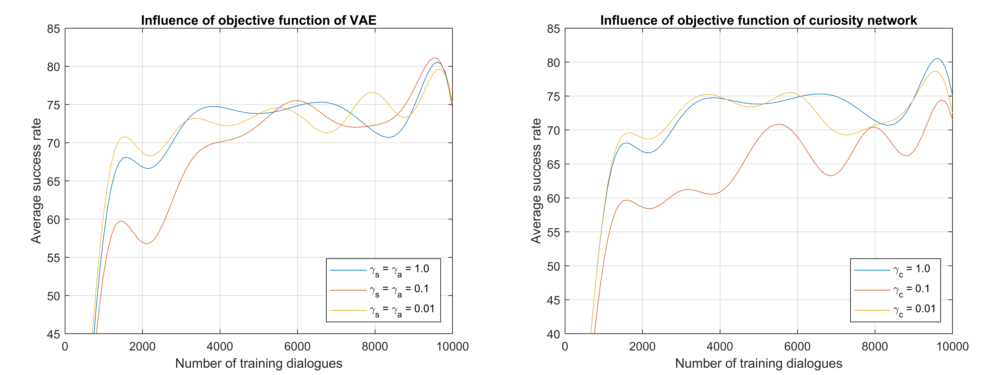
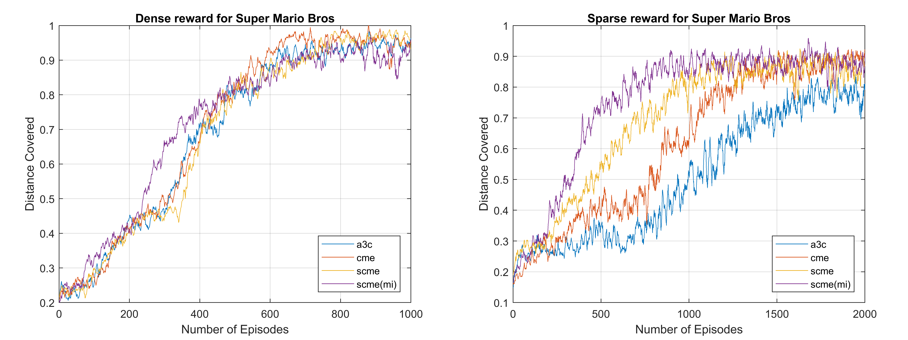

# Stochastic-Curiosity-Maximizing-Exploration
## Introduction
In this repository, we implement Stochastic Curiosity Maximizing Exploration (SCME) for PyDial and Super Mario Bros. Stochastic Curiosity Maximizing Exploration (SCME) is a general model-based method to improve exploration and deal with sparse reward tasks. Our model builds latent dynamic system, predicts future latent state distribution, and calculates mutual information between predicted future latent state and latent action. Our method makes an agent have wide view like a thinking human.

## Setting
* Hardware:
  * CPU: Intel Core i7-7700K @3.60 GHz
  * RAM: 64 GB DDR4-2400
  * GPU: GeForce GTX 1080ti
* Framework:
  * Tensorflow
  * Pytorch
* Environment:
  * PyDial
  * OpenAI gym 'Super Mario Bros'
  
## Result
* PyDial

* Mario

## Code References
* http://www.camdial.org/pydial/
* https://github.com/sadeqa/Super-Mario-Bros-RL
